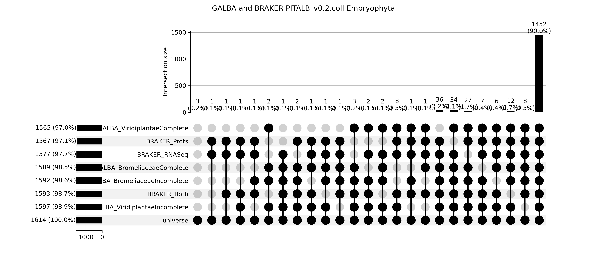
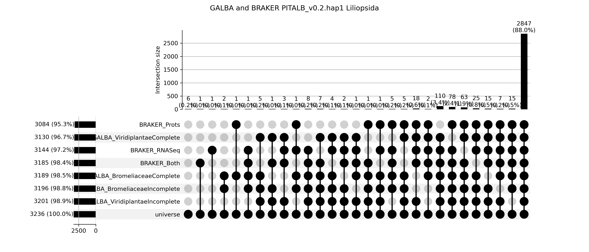

# Genome annotation of __Pitcairnia albiflos__

## Gene prediction with extrinsic evidence

We use two pipelines to predict gene models exploiting extrinsic evidence, BRAKER which can use Protein, RNASeq or both kinds of dataset as extrinsic evidence, and GALBA which only uses proteins as extrinsic evidence.

| Number | Evidence | BRAKER | GALBA |
| --- | --- | --- | --- |
| 1 | Protein Sequences Viridiplantae from OrthoDB v10 | X | X |
| 2 | RNASeq (CHA742B,CHA744,CHA745A,CHA747,CHA749B,PBO670,PBO674A,PBO675,PBO677,PBO678)| X | |
| 3 | Protein Sequences Bromeliaceae from NCBI | | X |
| 4 | Proteins Viridiplantae and RNASeq | X | |

BRAKER was run in three different ways, with only evidence 1, only evidence 2 and with both evidences 1 and 2. GALBA was run two times, onece with evidence 1 and once with evidence 2.

We run annotation on the collapsed version of the genome and also on hap1.

### BUSCO results

| Sowftware and Evidence | Assembly | Complete BUSCO | Single BUSCO | Duplicated BUSCO | Fragmented BUSCO | Missing BUSCO | N BUSCO | BUSCO DB |
| --- | --- | --- | --- | --- | --- |--- | --- | --- |
| BRAKER 1 | Collapsed | 91.5% | 84.4% | 7.1% | 4.7% | 3.8% | 1614 | Embryophyta |
| BRAKER 2 | Collapsed | 95.2% | 75.1% | 20.1% | 2.5% | 2.3% | 1614 | Embryophyta |
| BRAKER 1 and 2 | Collapsed | 98.6% | 80.0% | 18.6% | 0.1% | 1.3% | 1614 | Embryophyta |
| BRAKER 1 | Collapsed | 92.8% | 84.4% | 8.4% | 3.2% | 4.0% | 3236 | Liliopsida |
| BRAKER 2 | Collapsed | 92.1% | 73.6% | 18.5% | 4.9% | 3.0% | 3236 | Liliopsida |
| BRAKER 1 and 2 | Collapsed | 97.8% | 79.2% | 18.6% | 0.6% | 1.6% | 3236 | Liliopsida |
| BRAKER 1 | Hap1 | 91.8% | 84.1% | 7.7% | 3.5% | 4.7% | 3236 | Liliopsida |
| BRAKER 2 | Hap1 | 92.0% | 73.9% | 18.1% | 5.1% | 2.9% | 3236 | Liliopsida |
| BRAKER 1 and 2 | Hap1 | 97.8% | 79.2% | 18.6% | 0.6% | 1.6% | 3236 | Liliopsida |
| BRAKER 1 | Hap1 | 91.8% | 84.1% | 7.7% | 3.5% | 4.7% | 3236 | Liliopsida |
| BRAKER 2 | Hap1 | 92.0% | 73.9% | 18.1% | 5.1% | 2.9% | 3236 | Liliopsida |
| BRAKER 1 and 2 | Hap1 | 97.8% | 79.7% | 18.1% | 0.6% | 1.6% | 3236 | Liliopsida |
| GALBA 1 | Collapsed | 98.4% | 82.8% | 15.6% | 0.6% | 1.0% | 1614 | Embryophyta |
| GALBA 3 | Collapsed | 97.0% | 81.7% | 15.6% | 1.4% | 1.3% | 1614 | Embryophyta |
| GALBA 1 | Collapsed | 97.3% | 81.7% | 15.6% | 1.4% | 1.3% | 3236 | Liliopsida |
| GALBA 3 | Collapsed | 96.4% | 69.4% | 27.0% | 2.0% | 1.6% | 3236 | Liliopsida |
| GALBA 1 | Hap1 | 98.0% | 82.5% | 15.5% | 0.9% | 1.1% | 1614 | Embryophyta |
| GALBA 3 | Hap1 | 98.1% | 67.6% | 30.5% | 1.2% | 0.7% | 1614 | Embryophyta |
| GALBA 1 | Hap1 | 97.3% | 82.4% | 14.9% | 1.7% | 1.0% | 3236 | Liliopsida |
| GALBA 3 | Hap1 | 96.7% | 70.5% | 26.2% | 2.0% | 1.3% | 3236 | Liliopsida |

Pay attention that the duplicated BUSCOs here most likely mean alternative gene model versions produced by Augustus and not paralogs.

Also  note that we are getting an excelent proportion of complete BUSCOs. In the case of BRAKER the best performance is using both protein and RNASeq evidence. And with GALBA the best performance is with sequences from Viridiplantae form OrthoDB.

But we must not stop at just looking at these numbers. We must look at the overlaps in the BUSCO identification by the different strategies. For instance it could be that one Missing BUSCO in one prediciont set is present in another prediction set. Let's look at that using upsetplots:

Each black ball represent the number of BUSCO genes found. Balls conected with black lines represent intersections. All BUSCO genes found were counted, i.e., complete and fragmented.

Universe represent all BUSCO genes (100%), in either Embryophyta or Liliopsida.

Pay attention that there are some BUSCO genes only present in one of the prediction attempts, which suggests that we should combine all the attempts into a consensus prediction, using TSEBRA or EvidenceModeller.

